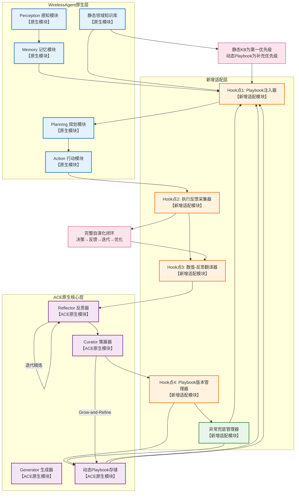

---

## 一、完整集成方案思路

### 1.1 核心集成逻辑底层对齐

### （1）WirelessAgent原生框架的核心瓶颈

WirelessAgent原生框架基于固定系统prompt+静态领域知识库实现资源分配，在动态无线场景下面临两个核心痛点：

- **上下文适应性差**：固定prompt与静态知识库无法沉淀过往的成功/失败决策经验，面对用户数波动、信道状态变化、网络负载动态调整等场景，无法快速适配优化，只能依赖固定规则处理，边缘场景决策准确率低。
- **无自演化能力，存在上下文坍塌风险**：原生框架没有动态的策略积累机制，无法通过执行反馈持续优化决策逻辑；若通过人工迭代prompt优化，极易出现整体重写导致的上下文坍塌，丢失关键的领域规则与有效策略。

### （2）ACE框架解决瓶颈的核心能力

ACE框架的原生设计完美匹配上述痛点的解决需求：

- **增量delta更新机制**：仅对上下文做条目化的局部增量更新，不整体重写playbook，从根本上避免上下文坍塌，同时完整保留历史沉淀的有效策略。
- **三角色自演化闭环**：通过Generator- Reflector-Curator的分工闭环，仅依靠执行反馈即可完成策略的提炼、优化与沉淀，无需标注数据与模型重训练，适配无线场景的动态性与实时性要求。
- **结构化playbook设计**：将策略、规则、避坑指南做条目化分类存储，可直接作为决策上下文注入prompt，无需修改原生决策逻辑。

### （3）二者集成的核心锚点

以**非侵入式注入**为核心原则，将ACE动态演化的playbook作为WirelessAgent Planning模块的补充决策上下文，在每次资源分配决策前，将「原生系统prompt+静态知识库+ACE动态playbook」拼接注入，替代原有固定prompt；全程保留WirelessAgent原生的核心资源分配算法、网络模拟逻辑、静态知识库内容，仅做决策上下文的补充扩展，不修改任何原生核心逻辑。

---

### 1.2 集成方案核心模块设计

### （1）整体集成架构设计

融合架构分为三层，全程松耦合交互，不突破两个框架的原生核心逻辑边界：

| 架构分层 | 模块组成 | 核心说明 |
| --- | --- | --- |
| WirelessAgent原生层 | Perception感知模块、Memory记忆模块、Planning规划模块、Action行动模块、静态领域知识库、原生外部工具集 | 100%保留原生框架的所有核心模块与逻辑，不做任何修改，仅通过Hook点做输入补充与输出采集 |
| ACE原生核心层 | Generator生成器、Reflector反思器、Curator策展器、动态Playbook存储 | 100%基于ACE官方API实现，不修改原生三角色闭环逻辑，仅针对无线场景做playbook结构的场景化适配 |
| 新增适配层 | Playbook注入器、执行反馈采集器、数值-反思翻译器、异常兜底管理器 | 唯一新增的模块，用于实现两个框架的适配交互，承担数据格式转换、上下文注入、异常兜底的职责，不涉及任何核心决策逻辑的修改 |

### （2）核心Hook点设计

所有Hook点均为非侵入式设计，仅做输入补充与输出采集，不修改原生流程的核心逻辑：

| Hook点编号 | 接入位置 | 核心作用 | 数据流转逻辑 |
| --- | --- | --- | --- |
| Hook点1 | Perception→Memory流程结束后，Planning模块初始化节点之前 | 为Planning模块注入动态决策上下文 | 从ACE层获取最新稳定版动态Playbook，与原生静态知识库拼接后，作为Planning模块的prompt输入，不修改原生规划逻辑 |
| Hook点2 | Action模块资源分配执行、网络状态更新完成后，结果导出之前 | 采集决策执行的反馈数据 | 不修改原生执行逻辑，仅被动采集本次决策的执行指标、决策轨迹、QoS满足情况，输出到适配层 |
| Hook点3 | 执行反馈采集完成后，ACE反思流程启动之前 | 完成数值信号到自然语言反思信号的转换 | 接收采集的数值指标，通过数值-反思翻译器转换为ACE可识别的自然语言反思素材，输入到ACE的Reflector模块 |
| Hook点4 | ACE的Curator完成Playbook更新后，下一轮注入之前 | 完成Playbook的版本管理与异常校验 | 接收Curator输出的更新后Playbook，做格式校验、冲突过滤、版本管理，仅将稳定有效的版本同步到Playbook注入器 |

### （3）自演化闭环完整流程

端到端形成完整的决策-反馈-迭代-优化闭环，全程不修改原生核心逻辑：

1. **资源分配决策环节**：WirelessAgent的Perception模块采集用户与网络数据→Memory模块存储全局状态→Planning模块通过Hook点1获取「静态知识库+动态Playbook」作为决策上下文，完成意图理解、切片分配、带宽分配决策→Action模块执行资源分配，完成与无线环境的交互。
2. **执行结果反馈环节**：通过Hook点2采集本次决策的全量数据，包括：网络性能指标（吞吐量、带宽利用率、SINR、时延）、业务指标（用户接入数、QoS满足率）、决策轨迹（用到的知识库条目、Playbook条目、分配逻辑）。
3. **数值-反思转换环节**：通过Hook点3的数值-反思翻译器，将离散的数值指标转换为ACE可识别的结构化自然语言反思素材，明确本次决策的成功点、失败根因、可复用策略、优化方向。
4. **ACE策略迭代环节**：Reflector基于反思素材完成诊断，提炼可复用的策略洞察→Curator基于洞察生成delta增量条目，执行Grow-and-Refine优化（去重、剪枝、冗余清理），完成动态Playbook的增量更新。
5. **下一轮决策注入环节**：更新后的稳定版Playbook通过Hook点4同步到Playbook注入器，在下一轮用户决策时，通过Hook点1注入到Planning模块，完成完整的自演化闭环。

### （4）数值-反思翻译器设计

分为最小闭环规则式方案与后续优化方案，全程不修改两个框架的原生逻辑：

- **Phase1最小闭环规则式实现**：基于固定规则完成数值到自然语言的映射，覆盖三类核心场景：
    1. 成功场景：当带宽利用率、QoS满足率、接入用户数达到预设阈值时，生成结构化的可复用策略描述，明确场景条件、决策动作、执行效果。
    2. 失败场景：当出现QoS不满足、切片容量溢出、负载不平衡等问题时，生成根因诊断与优化方向描述，明确错误动作、问题原因、修正方案。
    3. 优化场景：当出现可提升的空间时，生成优化策略描述，明确优化方向、执行逻辑、预期效果。
- **后续可优化的LLM驱动方案**：将采集的全量反馈数据、决策轨迹、QoS约束输入LLM，生成更精准的场景化洞察，支持复杂多用户、动态信道场景的策略提炼。

### （5）静态KB与动态playbook的兼容方案

严格遵循保留原生静态KB的红线规则，设计三级兼容逻辑：

1. **优先级规则**：原生静态知识库为第一优先级，动态Playbook为补充优先级。静态KB中的切片匹配规则、QoS硬约束、协议规范必须严格遵守；动态Playbook仅提供满足硬约束前提下的性能优化策略、场景化决策经验。
2. **prompt拼接逻辑**：Planning模块的prompt固定拼接顺序为：原生系统prompt → 静态知识库内容 → 动态Playbook内容 → 当前用户输入数据，保证模型优先读取静态KB的硬规则，避免被动态内容覆盖。
3. **冲突处理规则**：Playbook注入器会自动过滤与静态KB硬规则冲突的Playbook条目，仅注入无冲突的补充内容；同时将冲突条目反馈给Reflector，标记为harmful，在后续Playbook更新中移除。

### （6）容错兜底机制设计

严格遵循系统稳定性要求，设计全场景兜底规则，保证系统不会因ACE模块异常中断：

1. **ACE模块调用异常兜底**：当Reflector/Curator调用超时、LLM接口异常时，直接跳过本次Playbook更新流程，下一轮决策仅使用原生静态KB+上一个稳定版本的Playbook，不中断WirelessAgent的正常运行。
2. **Playbook更新异常兜底**：当出现delta条目格式错误、内容与静态KB冲突、条目冗余超标等问题时，自动拒绝本次更新，回滚到上一个稳定的Playbook版本，记录异常日志，不注入异常内容。
3. **性能波动异常兜底**：当连续3轮出现核心指标（带宽利用率、QoS满足率）下降超过10%时，自动触发Playbook回滚，回到性能稳定的历史版本，暂停自动更新，待人工审核后恢复。
4. **极端场景兜底**：当ACE相关模块全部出现异常时，系统自动切换回WirelessAgent原生基线模式，完全关闭ACE模块的注入，仅使用原生固定prompt+静态知识库运行，保证业务不中断。

---

## 二、ACE+WirelessAgent融合框架完整mermaid图

---

## 三、融合框架图逐模块详细讲解

### 3.1 模块分层与核心职责讲解

### （1）WirelessAgent原生层

该层100%保留了WirelessAgent的原生核心模块与逻辑，未做任何修改，是整个系统的业务执行主体：

- **Perception感知模块**：核心作用是采集无线环境与用户的输入数据，包括用户ID、CQI、业务请求、信道状态、网络负载等信息；输入为外部环境的原始数据，输出为结构化的感知结果，是整个流程的起点。
- **Memory记忆模块**：核心作用是存储系统的全局状态，包括历史决策记录、网络状态、中间结果等；输入为感知模块的输出，输出为系统全局状态，为规划模块提供基础的状态数据。
- **Planning规划模块**：核心作用是完成资源分配的决策逻辑，包括意图理解、切片分配、带宽分配、网络评估；输入为Hook点1注入的「静态KB+动态Playbook+全局状态」，输出为资源分配决策方案，是ACE动态能力的核心生效点。
- **Action行动模块**：核心作用是执行规划模块的决策，完成切片分配、资源调整、网络状态更新；输入为决策方案，输出为执行后的网络状态与结果，是反馈数据的来源。
- **静态领域知识库**：核心作用是提供无线通信、网络切片的硬规则与领域知识，是决策的第一优先级依据，全程保留原生内容，未做任何修改。

### （2）新增适配层

该层是两个框架的桥梁，全程仅做适配交互，不涉及任何核心决策逻辑的修改：

- **Hook点1：Playbook注入器**：设计原因是为了在不修改原生规划逻辑的前提下，为决策补充动态上下文；核心作用是将静态KB与动态Playbook按优先级拼接，注入到规划模块的prompt中；触发条件为每一轮用户决策前，输入为静态KB内容、最新稳定版动态Playbook，输出为拼接完成的决策上下文。
- **Hook点2：执行反馈采集器**：设计原因是为了获取ACE自演化所需的反馈信号，同时不修改原生执行逻辑；核心作用是被动采集决策执行后的全量指标与轨迹数据；触发条件为每一轮决策执行完成后，输入为Action模块的执行结果，输出为结构化的反馈数据集。
- **Hook点3：数值-反思翻译器**：设计原因是为了将无线场景的连续数值指标，转换为ACE可识别的自然语言反思信号；核心作用是完成数值到结构化反思素材的转换；触发条件为反馈数据采集完成后，输入为数值反馈数据集，输出为ACE可处理的自然语言反思内容。
- **Hook点4：Playbook版本管理器**：设计原因是为了保证注入的Playbook稳定有效，避免异常内容影响系统性能；核心作用是完成Playbook的格式校验、冲突过滤、版本管理；触发条件为Curator完成Playbook更新后，输入为更新后的Playbook，输出为校验通过的稳定版Playbook。
- **异常兜底管理器**：核心作用是处理所有ACE相关的异常场景，保证系统稳定性；输入为模块异常信号、性能波动数据，输出为兜底处理指令（回滚、降级、切换基线模式）。

### （3）ACE原生核心层

该层100%基于ACE官方API实现，保留了原生的三角色自演化闭环，是系统动态优化的核心：

- **Reflector反思器**：核心作用是基于反思素材诊断决策问题，提炼可复用的策略洞察；输入为数值-反思翻译器输出的反思内容，输出为结构化的策略洞察与根因分析；支持多轮迭代精炼，保证洞察的精准性。
- **Curator策展器**：核心作用是将洞察转换为增量delta条目，完成Playbook的更新与优化；输入为Reflector输出的洞察，输出为更新后的Playbook；原生的Grow-and-Refine机制会完成去重、剪枝，避免上下文坍塌。
- **动态Playbook存储**：核心作用是存储条目化的动态策略，包括切片分配规则、带宽优化策略、负载平衡方法、避坑指南等；是ACE自演化能力的载体，也是补充决策上下文的来源。
- **Generator生成器**：在本集成方案中，Generator的能力与WirelessAgent的Planning模块对齐，由Planning模块承担生成决策轨迹的职责，保证原生逻辑的完整性。

### 3.2 流程流转与核心优势讲解

### （1）主流程流转逻辑

系统的主流程分为两条并行链路：

1. **原生业务执行链路**：Perception→Memory→Hook点1注入上下文→Planning决策→Action执行，全程保留WirelessAgent的原生业务逻辑，仅补充了决策上下文，业务执行的核心逻辑完全不变。
2. **ACE自演化闭环链路**：Action执行完成→Hook点2采集反馈→Hook点3转换反思信号→Reflector提炼洞察→Curator更新Playbook→Hook点4校验版本→下一轮注入，形成完整的自优化闭环，全程不干扰原生业务的正常执行。

### （2）集成设计的核心优势

1. **彻底解决原生框架的痛点**：通过ACE的增量更新机制，避免了上下文坍塌；通过自演化闭环，实现了对动态无线环境的自适应优化，大幅提升了边缘场景的决策准确率与系统性能。
2. **完全符合红线规则**：全程非侵入式设计，未修改WirelessAgent与ACE的原生核心逻辑，仅通过适配层做交互，保留了原生基线的所有能力，对比实验完全公平。
3. **稳定性与可扩展性兼顾**：完善的兜底机制保证了系统不会因ACE模块异常中断；同时模块化的适配层设计，支持后续对反思逻辑、Playbook结构做扩展优化，无需修改原生框架。

### （3）自演化闭环的触发与更新规则

- **触发时机**：默认每完成一个用户的资源分配决策，触发一次反馈采集与反思迭代；也可配置为批量触发（每完成N个用户决策后批量更新），平衡实时性与计算开销。
- **更新规则**：仅做增量delta更新，不整体重写Playbook；每次更新仅新增/修改相关条目，保留所有历史有效策略；定期执行Grow-and-Refine优化，清理冗余、无效的条目，控制Playbook的规模，避免上下文窗口溢出。

---

## 四、Phase1最小闭环落地步骤规划

### 步骤1：集成方案最终确认

完成本次集成方案、融合框架图的审阅与确认，明确所有模块的边界、交互逻辑、红线规则，形成正式的集成设计文档，作为后续所有工作的依据。

### 步骤2：适配层与Hook点的详细设计

完成四个Hook点的详细交互设计、适配层五个模块的详细逻辑设计，明确每个模块的输入输出、触发条件、异常处理规则，保证所有交互完全基于两个框架的官方API，不修改任何原生核心逻辑。

### 步骤3：ACE无线场景化适配设计

完成适配网络切片场景的ACE Playbook结构设计，明确Playbook的分类模块、条目格式；完成适配无线场景的Reflector反思prompt设计、Curator增量更新规则设计，全程基于ACE官方API实现，不修改ACE原生核心逻辑。

### 步骤4：兼容规则与兜底机制确认

完成静态KB与动态Playbook的prompt拼接逻辑、优先级规则、冲突处理规则的详细设计；完成所有异常场景的兜底处理、回滚机制的详细设计，形成可落地的执行规范，保证系统的稳定性与基线一致性。

### 步骤5：最小闭环验证用例设计

设计单用户、多用户场景的最小闭环验证用例，明确每个用例的输入、预期输出、验证指标，保证集成后的系统可以跑通端到端的自演化闭环，同时核心功能与原生基线一致。

### 步骤6：基线对比实验方案设计

设计与原生基线的对比实验方案，保证实验的网络场景、用户参数、信道配置、资源约束完全一致，唯一变量为ACE模块的集成；明确对比核心指标（带宽利用率、最大支持用户数、平均吞吐量、QoS满足率），保证实验结果的公平性与可复现性。

### 步骤7：方案落地前的最终合规校验

完成全方案的红线规则校验，确认所有设计未突破两个框架的原生核心逻辑边界，未修改原生基线的任何核心配置，符合项目的所有要求，完成最终的方案冻结。