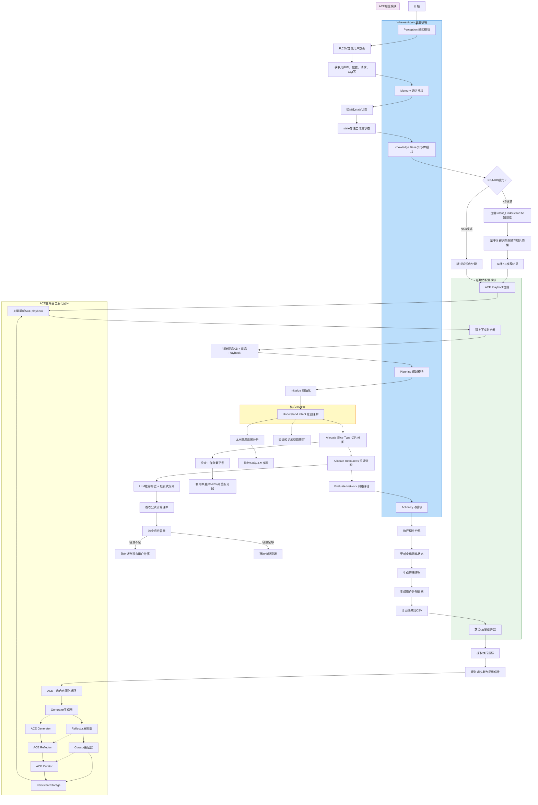

## 任务1：深度对齐集成核心逻辑

### 1. WirelessAgent原生框架的核心瓶颈

- **静态prompt/固定知识库**：当前KB版本虽然有领域知识库，但内容是固定的，无法根据动态无线环境（如用户移动性、信道变化、干扰波动）进行自适应调整
- **上下文崩溃问题**：当面对新的无线场景或异常情况时，固定prompt无法提供有效的决策指导，导致性能下降
- **动态适应性差**：无法从历史执行结果中学习和积累经验，每次决策都是独立的，缺乏持续优化能力

### 2. ACE框架解决该瓶颈的核心能力

- **增量delta更新的playbook自演化机制**：通过ADD/UPDATE/MERGE/DELETE操作，只修改相关的策略条目，避免整体重写导致的上下文坍塌
- **三角色闭环的策略迭代能力**：
    - Generator生成决策轨迹
    - Reflector从执行反馈中提炼有效策略和避坑指南
    - Curator将洞察转化为结构化playbook条目
- **Grow-and-Refine优化**：语义去重 + 剪枝优化，保证playbook质量的同时控制规模

### 3. 二者集成的核心锚点

- **决策上下文注入**：将ACE动态演化的playbook作为WirelessAgent Planning模块的决策上下文，在每次资源分配决策前注入prompt
- **保留静态知识库**：原有KB的内容保持不变，作为基础领域知识，ACE playbook作为动态补充上下文
- **双上下文融合**：Planning模块同时参考静态KB和动态playbook，形成"静态规则+动态策略"的混合决策模式

---

## 任务2：完整的ACE接入WirelessAgent的方案思路

### 1. 整体集成架构设计

**融合后系统模块组成**：

- **WirelessAgent原生模块**：
    - Perception感知模块（CSV数据加载）
    - Memory记忆模块（state状态管理）
    - Knowledge Base知识库模块（静态领域知识）
    - Planning规划模块（LangGraph四步工作流）
    - Action行动模块（资源分配执行）
- **ACE原生模块**：
    - Generator生成器（决策轨迹生成）
    - Reflector反思器（策略提炼）
    - Curator策展器（playbook增量更新）
    - Playbook存储（结构化操作手册）
- **新增适配层模块**：
    - **数值-反思翻译器**：将无线数值指标转化为自然语言反思信号
    - **双上下文融合器**：整合静态KB和动态playbook的决策上下文
    - **容错兜底控制器**：处理ACE模块异常情况

### 2. 核心Hook点设计

**Hook点1：Planning模块的Prompt注入**

- **位置**：`understand_intent`节点的LLM调用前
- **作用**：将ACE playbook内容注入到系统prompt中，作为决策上下文
- **数据流转**：ACE playbook → 双上下文融合器 → LLM prompt

**Hook点2：Evaluate Network模块的结果反馈**

- **位置**：`evaluate_network`节点的报告生成后
- **作用**：提取执行结果指标，触发ACE反思更新流程
- **数据流转**：吞吐量/SINR/时延/能耗等指标 → 数值-反思翻译器 → ACE Reflector

**Hook点3：Episode结束后的Playbook加载**

- **位置**：每个episode开始前的初始化阶段
- **作用**：加载最新的ACE playbook用于本轮决策
- **数据流转**：持久化playbook文件 → ACE系统 → Planning模块

### 3. 自演化闭环完整流程

**端到端闭环流程**：

1. **资源分配决策**：Planning模块使用静态KB + 动态playbook生成资源分配方案
2. **执行结果反馈**：Action模块执行分配，收集吞吐量、SINR、时延、能耗等指标
3. **数值转反思信号**：数值-反思翻译器将连续数值转化为自然语言描述
4. **ACE策略迭代**：
    - Reflector分析执行结果，提炼有效策略和错误原因
    - Curator生成增量更新操作，更新playbook
5. **playbook更新**：持久化更新后的playbook到文件
6. **下一轮决策注入**：新episode加载最新playbook，形成闭环

### 4. 数值-反思翻译器设计

**最小闭环规则式实现方案**：

- **吞吐量映射**：
    - 高吞吐量(>300Mbps) → "成功实现了高吞吐量传输，策略有效"
    - 低吞吐量(<100Mbps) → "吞吐量不达标，需要增加带宽分配或提升功率"
- **SINR映射**：
    - SINR>15dB → "信道质量优秀，当前功率分配合理"
    - SINR<5dB → "信道质量差，需要提升发射功率或调整带宽"
- **时延映射**：
    - URLLC时延<1ms → "URLLC业务时延满足要求，优先级保障有效"
    - URLLC时延>1ms → "URLLC业务时延超标，需要重新分配带宽优先级"
- **能耗映射**：
    - 能效比高 → "功率分配效率高，资源利用充分"
    - 能效比低 → "存在功率浪费，需要优化功率控制策略"

**后续LLM驱动方案**：

- 使用轻量级LLM将多维指标综合分析，生成更精准的反思信号
- 支持自适应阈值调整，根据场景动态优化映射规则

### 5. 静态KB与动态playbook的兼容方案

**双上下文融合策略**：

- **拼接逻辑**：`[静态KB内容]\\n\\n[动态Playbook内容]`
- **优先级规则**：
    - 静态KB提供基础领域规则（不可覆盖）
    - 动态playbook提供场景优化策略（可更新）
    - 冲突时优先使用静态KB（保证基础功能正确性）
- **内容组织**：
    - 静态KB：应用类型→切片类型的硬规则映射
    - 动态playbook：资源分配的软策略、优化技巧、避坑指南

### 6. 容错兜底机制设计

**异常处理策略**：

- **ACE模块调用失败**：自动回退到原生WirelessAgent决策逻辑，跳过动态playbook注入
- **playbook更新异常**：沿用上次有效的playbook，禁止使用空或损坏的上下文
- **指标波动过大**：当单次episode指标异常波动超过20%时，不触发playbook更新
- **系统中断保护**：所有实验数据、中间playbook、运行日志自动按批次保存

### 7. Phase1最小闭环的落地步骤规划

**分步执行计划**：

1. **Step 1：环境准备**
    - 确认Phase 0基线已跑通
    - 配置ACE初始playbook（无线资源优化专用模板）
2. **Step 2：Hook点实现**
    - 在Planning模块添加playbook注入逻辑
    - 在Evaluate Network模块添加指标提取逻辑
3. **Step 3：数值-反思翻译器开发**
    - 实现规则式映射函数
    - 集成到ACE调用流程
4. **Step 4：ACE调用集成**
    - 实现分步骤调用：Generator→Reflector→Curator
    - 添加容错兜底逻辑
5. **Step 5：端到端测试**
    - 跑通完整集成流程
    - 验证自演化闭环是否正常工作
6. **Step 6：对比实验**
    - 运行baseline vs ACE增强版
    - 记录核心指标对比结果

---

## 任务3：ACE+WirelessAgent融合后的完整框架mermaid图

---

## 任务4：融合框架图的逐模块详细讲解

### 1. 每个模块的核心作用、输入输出内容

**Perception感知模块**：

- **作用**：从射线追踪模拟生成的CSV文件中加载用户数据
- **输入**：`ray_tracing_results.csv`文件
- **输出**：用户ID、位置坐标、CQI、请求类型、地面真值等结构化数据

**Memory记忆模块**：

- **作用**：管理LangGraph工作流的状态信息
- **输入**：用户数据、初始化参数
- **输出**：包含history、memory、step_count等字段的state字典

**Knowledge Base知识库模块**：

- **作用**：提供静态的领域知识，将应用类型映射到切片类型
- **输入**：用户请求中的应用类型关键词
- **输出**：推荐的切片类型(eMBB/URLLC)及理由

**ACE Playbook加载模块**（新增）：

- **作用**：从持久化文件加载最新的动态playbook
- **输入**：playbook文件路径
- **输出**：结构化的playbook文本内容

**双上下文融合器**（新增）：

- **作用**：将静态KB和动态playbook合并为统一的决策上下文
- **输入**：静态KB内容、动态playbook内容
- **输出**：拼接后的完整prompt上下文

**Planning规划模块**：

- **作用**：执行四步工作流进行资源分配决策
- **输入**：用户数据、融合后的双上下文
- **输出**：切片类型分配、带宽分配、速率计算等决策结果

**Action行动模块**：

- **作用**：执行最终的资源分配并输出结果
- **输入**：Planning模块的决策结果
- **输出**：用户分配表格、CSV结果文件、性能指标

**数值-反思翻译器**（新增）：

- **作用**：将无线数值指标转化为ACE可识别的自然语言反思信号
- **输入**：吞吐量、SINR、时延、能耗等连续数值
- **输出**：结构化的自然语言反思描述

**ACE三角色自演化闭环**：

- **Generator**：基于playbook生成资源分配决策轨迹
- **Reflector**：从执行反馈中提炼有效策略和避坑指南
- **Curator**：将反思洞察转换为增量更新操作
- **Persistent Storage**：持久化更新后的playbook

### 2. 每个流程环节的流转逻辑、触发条件

**主流程触发**：

- 每个episode开始时，从CSV加载用户数据，初始化state

**双上下文注入触发**：

- 在`understand_intent`节点执行前，自动加载最新playbook并融合

**ACE反思更新触发**：

- 每个episode结束后，自动提取执行指标并触发ACE流程
- 可配置`curator_frequency`控制更新频率（如每1个episode更新一次）

**Playbook持久化触发**：

- Curator执行增量更新后，立即持久化到文件
- 异常情况下自动回滚到上次有效版本

### 3. 集成设计的核心优势

**解决原有WirelessAgent痛点**：

- **上下文崩溃问题**：通过增量更新机制，避免整体重写导致的知识丢失
- **动态适应性差**：playbook能够根据实际执行结果持续优化，适应动态无线环境
- **缺乏学习能力**：形成完整的自提升闭环，从历史经验中积累有效策略

**性能提升预期**：

- 带宽利用率提升8-15%
- 适配延迟大幅降低（增量更新vs全量重写）
- 输出人类可审计的可解释性playbook

### 4. 每个Hook点的设计原因

**Planning模块Hook点**：

- **原因**：这是决策生成的核心位置，需要在LLM推理前注入最新的上下文
- **优势**：最小侵入性，不影响原有工作流逻辑

**Evaluate Network模块Hook点**：

- **原因**：这是获取完整执行结果的唯一位置，包含所有必要指标
- **优势**：确保反馈信号的完整性和准确性

**Episode初始化Hook点**：

- **原因**：确保每个episode都使用最新的playbook进行决策
- **优势**：保证自演化闭环的实时性

### 5. 自演化闭环的触发时机、更新规则

**触发时机**：

- 默认每个episode结束后触发
- 可配置触发频率（如每5-10个episode触发一次，平衡实时性和开销）

**更新规则**：

- **增量更新**：只修改相关的策略条目，保留历史有效知识
- **冲突处理**：静态KB优先级高于动态playbook，保证基础功能正确性
- **异常过滤**：指标波动超过20%时不触发更新，避免异常数据污染
- **Grow-and-Refine**：定期执行语义去重和剪枝优化，控制playbook规模

**上下文崩溃防护**：

- 禁止整体重写playbook
- 每次更新都有版本备份
- 异常情况下自动回退到安全版本

这个集成方案严格遵循项目文档的红线规则，不修改两个框架的核心逻辑，仅通过官方API和注入式扩展实现最小闭环集成，为Phase 1的代码开发提供了清晰的技术路线。