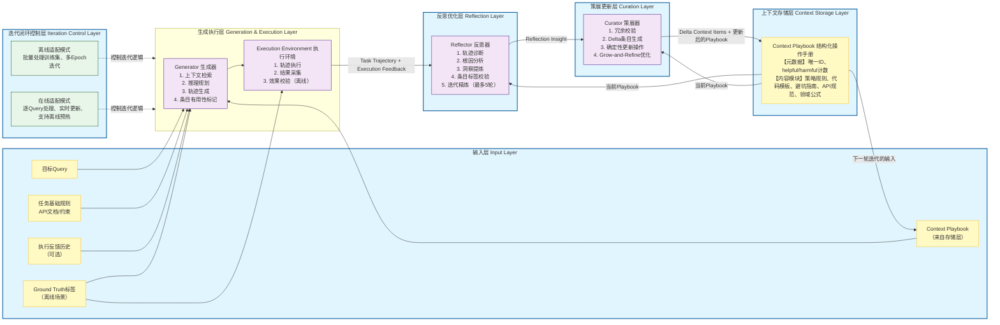

# 详细版ACE（Agentic Context Engineering）框架设计
本框架在原Figure 4的核心闭环基础上，补充了**执行环境层、模块内部执行逻辑、核心机制标注、离线/在线双模式适配、全链路数据流转细节**，完整覆盖论文中ACE的所有设计要点，可直接用于架构理解与代码复现。

---

## 一、整体架构分层
框架从左到右形成完整的自提升闭环，共分为6个核心层：
1. 输入层（Input Layer）
2. 生成执行层（Generation & Execution Layer）
3. 反思优化层（Reflection Layer）
4. 策展更新层（Curation Layer）
5. 上下文存储层（Context Storage Layer）
6. 迭代闭环控制层（Iteration Control Layer）

---

## 二、每层模块的详细设计
### 1. 输入层（Input Layer）
框架的入口，为全流程提供所有必要的输入信息，在原Figure 4的基础上补充了完整的输入项：
| 输入项 | 核心用途 | 适用场景 |
|--------|----------|----------|
| 目标Query | 用户的任务/问题输入，是全流程的处理目标 | 全场景 |
| Context Playbook | 结构化、条目化的上下文操作手册（来自上下文存储层），是ACE的核心上下文 | 全场景 |
| 任务基础规则 | 任务原生prompt、API文档、环境执行约束、输出格式要求等固定规则 | 全场景 |
| 执行反馈历史 | 过往任务的执行结果、错误日志（可选，用于复杂任务参考） | 全场景 |
| Ground Truth标签 | 任务的标准答案/正确执行轨迹，用于监督式优化 | 离线适配场景 |

### 2. 生成执行层（Generation & Execution Layer）
在原Figure 4的Generator基础上，补充了**执行环境子模块**，是连接生成与反思的核心环节，也是Reflector的核心输入来源。
#### 2.1 Generator（生成器）子模块
**核心职责**：基于输入信息生成符合要求的任务执行轨迹，同时标记Playbook条目的有用性
**内部执行步骤**：
1. 上下文检索匹配：从Context Playbook中检索与当前Query语义相关的条目，筛选候选可用内容
2. 推理规划：结合Query、基础规则、匹配到的Playbook内容，制定分步执行计划
3. 轨迹生成：输出完整的可执行轨迹（Agent场景为Python代码/API调用链；领域推理场景为分步推理过程/计算逻辑）
4. 条目有用性预标记：对本次推理用到的Playbook条目，预标记为helpful/harmful/neutral，用于后续反思校验
**输入**：目标Query、Context Playbook、任务基础规则
**输出**：可执行的Task Trajectory（任务轨迹）、Playbook条目预标记结果、推理中间过程

#### 2.2 Execution Environment（执行环境）子模块
**核心职责**：执行生成的任务轨迹，输出客观的执行反馈信号，为反思提供事实依据
**内部执行步骤**：
1. 轨迹执行：运行Generator输出的代码/调用API/执行推理步骤，完成和环境的交互
2. 结果采集：采集执行的状态（成功/失败）、返回数据、错误日志、异常信息
3. 效果校验（离线场景）：将执行结果和Ground Truth对比，生成测试报告、准确率统计
**输入**：Task Trajectory、可选的Ground Truth标签
**输出**：Execution Feedback（执行反馈，含执行状态、错误日志、返回结果、测试报告）

### 3. 反思优化层（Reflection Layer）
对应原Figure 4的Reflector模块，细化了内部迭代逻辑，完整覆盖论文中的迭代优化设计
**核心职责**：诊断执行轨迹的问题，定位根因，提炼可复用的结构化洞察，是ACE自提升的核心“大脑”
**内部执行步骤**：
1. 全链路轨迹诊断：对比任务目标与实际执行结果，定位执行中的错误环节、可优化的节点
2. 根因深度分析：拆解错误的本质原因（如API误用、数据来源错误、逻辑漏洞、领域概念误解、分页处理不当等）
3. 可复用洞察提炼：从成功/失败案例中，提炼通用的策略、硬规则、代码模板、避坑指南、计算公式等可跨任务复用的内容
4. 条目标签校验：基于执行结果，校验Generator预标记的Playbook条目有用性，输出最终的标签结果
5. 迭代精炼（Iterative Refinement）：如果洞察不清晰、根因定位不准确，重复上述步骤，最多迭代指定轮数（论文默认5轮）
**输入**：Task Trajectory、Execution Feedback、Context Playbook、条目预标记结果、可选的Ground Truth
**输出**：结构化Reflection Insight（含错误定位、根因分析、正确方案、可复用洞察、条目最终标签）

### 4. 策展更新层（Curation Layer）
对应原Figure 4的Curator模块，细化了增量更新、Grow-and-Refine的核心逻辑，是ACE避免上下文坍塌的核心设计
**核心职责**：将反思洞察转换为增量更新条目，确定性地合并到现有Playbook中，平衡上下文的增长与冗余控制
**内部执行步骤**：
1. 冗余校验：对比Reflection Insight与现有Playbook的条目，判断是新增内容、现有内容的更新，还是重复冗余内容
2. Delta条目生成：将有效洞察转换为符合Playbook格式的结构化条目，分配唯一ID，初始化元数据（helpful/harmful计数）
3. 确定性更新操作（非LLM逻辑，避免上下文坍塌）：
   - ADD：新增现有Playbook中没有的有效条目
   - UPDATE：原地更新现有条目的元数据、补充内容，不整体重写
   - DELETE：标记长期被标记为harmful、无效的条目，待清理
4. Grow-and-Refine优化：
   - 去重：通过语义嵌入对比，合并高度重复、相似的条目
   - 剪枝：清理无效、冗余的条目，控制Playbook的规模
   - 结构整理：按模块分类整理条目，保证结构化
**输入**：Reflection Insight、当前Context Playbook
**输出**：Delta Context Items（增量更新条目集合）、更新后的完整Context Playbook

### 5. 上下文存储层（Context Storage Layer）
对应原Figure 4的Context Playbook，细化了Playbook的结构化设计，是ACE的核心“记忆体”
**核心职责**：存储结构化的Context Playbook，为全流程提供上下文支持，接收策展层的更新
**Playbook结构化设计**：
每个Playbook是条目化的集合，每个条目包含：
- 元数据：唯一ID、helpful计数、harmful计数、创建时间、最后更新时间
- 内容（分模块存储）：
  1. 策略与硬规则（Strategies and Hard Rules）
  2. 可用代码片段与模板（Useful Code Snippets and Templates）
  3. 故障排除与避坑指南（Troubleshooting and Pitfalls）
  4. API规范与数据来源说明（API Specifications & Data Source Rules）
  5. 领域公式与计算规则（Domain Formulas & Calculation Rules）
**核心特性**：支持增量更新、并行合并、细粒度检索，不做整体重写，避免上下文坍塌

### 6. 迭代闭环控制层（Iteration Control Layer）
将原Figure 4中隐含的迭代逻辑明确为独立层，区分离线/在线两种适配模式
**核心职责**：控制整个框架的迭代流程，适配不同的业务场景
#### 6.1 离线适配模式（系统Prompt优化）
- 迭代逻辑：批量处理训练集的Query，完成多轮Epoch迭代（论文默认最大5轮），批量合并Delta更新
- 输出：收敛后的固定Context Playbook，直接用于后续的任务推理
- 适用场景：任务固定、有标注训练数据，需要提前优化好通用上下文

#### 6.2 在线适配模式（测试时内存适配）
- 迭代逻辑：逐Query处理，每完成一个任务的全流程，就更新一次Playbook，实时用于下一个任务
- 优化方案：支持离线预热（先通过离线适配初始化Playbook，再在线更新），进一步提升性能
- 适用场景：无标注数据、任务分布动态变化，需要实时自提升的Agent场景

---

## 三、全链路数据流转闭环
1. 从上下文存储层加载当前的Context Playbook，和目标Query、任务基础规则一起输入到Generator
2. Generator生成Task Trajectory，输入到执行环境
3. 执行环境运行轨迹，输出Execution Feedback，和Task Trajectory一起输入到Reflector
4. Reflector诊断分析，输出结构化的Reflection Insight，输入到Curator
5. Curator基于洞察生成Delta Context Items，更新Context Playbook并存储
6. 更新后的Context Playbook用于下一个任务的处理，形成完整的自提升迭代闭环

---

### 一、架构的核心定位
ACE这套架构是在Dynamic Cheatsheet的自适应内存设计基础上优化而来的，它把LLM上下文适配的全流程，拆成了**Generator、Reflector、Curator三个各司其职的专用模块**，替代了传统方法里“单个LLM一次性完成全流程处理”的模式。
核心目标是解决传统上下文优化的两大痛点：**简洁性偏差（丢失关键细节）**和**上下文坍塌（迭代重写导致知识丢失）**，让LLM的上下文能像可迭代优化的“操作手册”一样，持续积累经验、实现自提升。

---

### 二、三个核心组件的职责与作用
#### 1. Generator（生成器）：架构的执行入口，任务的“执行者”
对应Figure4最左侧的模块，是整个工作流的起点。
- 核心输入：新的任务Query、当前的Context Playbook（上下文操作手册）、任务基础规则
- 核心工作：基于输入的上下文，为新查询生成完整的**推理轨迹**（比如Agent场景的Python代码执行链、API调用过程；领域任务的分步推理、计算逻辑）
- 关键价值（来自你选中的原文）：生成的轨迹会同时暴露两类核心信息——**本次任务里有效的策略**，以及**反复出现的错误、踩坑点**，这些是后续整个架构优化的核心素材，相当于先“跑通一遍任务，把好坏经验都记录下来”。

#### 2. Reflector（反思器）：架构的“诊断大脑”，经验的“提炼者”
对应Figure4中间的模块，是整个架构实现自提升的核心。
- 核心输入：Generator生成的完整推理轨迹、任务的执行反馈（比如代码运行的成功/失败结果、错误日志）
- 核心工作：对推理轨迹做全链路复盘诊断，从成功的步骤里提炼可复用的通用策略，从失败的环节里定位根因、总结避坑方法，最终输出结构化的、可落地的经验洞察。
- 关键价值（来自你选中的原文）：支持**多轮迭代精炼**，如果一次反思的洞察不够精准、不够深入，可以重复迭代优化，确保提炼的经验是可复用的，而不是泛泛的模糊结论。

#### 3. Curator（策展器）：架构的“记忆管理员”，解决上下文坍塌的核心设计
对应Figure4最右侧的模块，是ACE区别于传统方法的关键创新。
- 核心输入：Reflector提炼的经验洞察、当前的Context Playbook
- 核心工作：把零散的经验洞察，整合成紧凑的**delta增量条目**，再用轻量的、非LLM的确定性逻辑，把这些增量条目合并到现有的上下文里。
- 关键价值（来自你选中的原文）：
  1. 彻底避免上下文坍塌：它不会整体重写整个上下文，只做条目化、本地化的增量更新，100%保留历史积累的有效知识；
  2. 支持规模化适配：因为更新是分条目的、局部的，多个delta增量可以并行合并，能支持大规模的批量任务适配；
  3. 支持持续强化：配套多epoch适配能力，可以重复处理同一批查询，不断强化上下文里的有效策略，让操作手册越来越完善。

---

### 三、对应Figure4的完整工作流闭环
整个流程形成了完整的自提升闭环，步骤如下：
1. 新的Query和当前的Context Playbook输入到Generator，生成任务的推理轨迹；
2. 轨迹输入到Reflector，复盘诊断、提炼可复用的经验洞察，支持多轮迭代优化；
3. 洞察输入到Curator，生成增量delta条目，确定性合并更新Context Playbook；
4. 更新后的Context Playbook，会作为下一轮新Query的输入，开启新的迭代，实现持续的自提升。